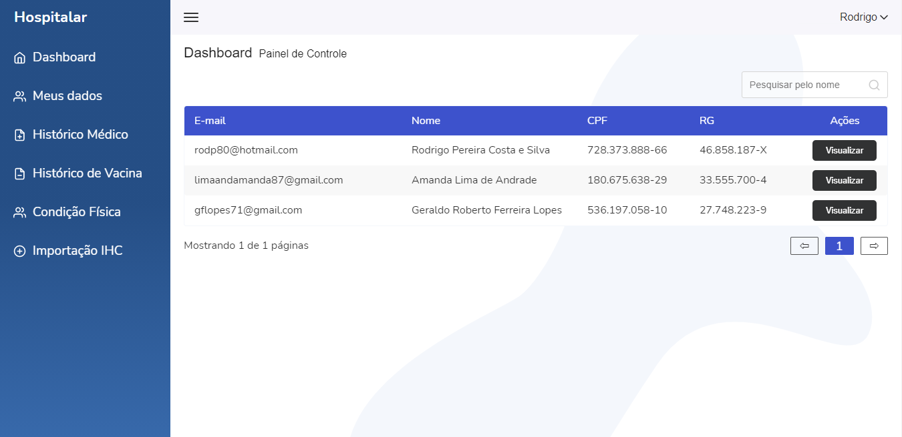

# Sistema Integrado Hospitalar (SIH)

## Sobre o projeto

É um sistema que fará a comunicação dos dados do paciente, entre os hospitais, facilitando o contato entre médicos e familiares dos pacientes, bem como os próprios pacientes em si. Preocupando-se com a saúde dos pacientes para que os riscos sejam minimizados, pois, o cuidado do paciente é responsabilidade de todos ao seu redor.

## 🚀 Tecnologias utilizadas

## Back-end
- Node.js (Nestjs)
- Express
- TypeORM
- MySQL
- JsonWebToken
- BodyParser
## Front-end
- HTML5 / SASS / JavaScript
- ReactJS
- Redux (toolkit)
- React Router Dom
- Victory
- Node Sass

### 🔧 Instalação e execução do sistema

## Back-end
📋 Pré-requisitos: npm / yarn

```bash
# clonar repositório
git clone https://gitlab.com/unimar-ads/sistema-integrado-hospitalar/backend.git

# entrar na pasta do projeto backend
cd backend

# instalar dependências
npm run install

# executar o projeto
npm run start:dev
```

## Front-end
📋 Pré-requisitos: npm / yarn

```bash
# clonar repositório
git clone https://gitlab.com/unimar-ads/sistema-integrado-hospitalar/frontend.git

# entrar na pasta do projeto frontend
cd frontend

# instalar dependências
npm run install

# executar o projeto
npm run start
```

## 🛠️ Construído com

* [Node.js](https://nodejs.org/en/) - é uma tecnologia usada para executar código JavaScript fora do navegador. Com ele podemos construir aplicações web em geral
* [Nestjs](https://nestjs.com/) - é uma estrutura para a construção de aplicativos da web Node.js eficientes e escalonáveis.
* [React.js](https://pt-br.reactjs.org/) - é uma biblioteca JavaScript de código aberto com foco em criar interfaces de usuário em páginas web.
* [Redux](https://redux-toolkit.js.org/) - é uma biblioteca JavaScript de código aberto para gerenciar o estado do aplicativo.
* [Xampp](https://www.apachefriends.org/pt_br/index.html) - é um pacote com os principais servidores de código aberto do mercado, incluindo FTP, banco de dados MySQL e Apache com suporte as linguagens PHP e Perl.

## 📌 Versão

Nós usamos [GitLab](https://gitlab.com/) para controle de versão.

## ✒️ Autores

* **André Coelho** - *Plano de Negócio* - [product owner](https://github.com/linkParaPerfil)
* **Nathan Oliveira** - *Backend - Frontend* - [scrum master / developer](https://www.linkedin.com/in/nathan-oliveira-mendonca)
* **Lucas Divino** - *Figma - Banco de dados* - [designer / developer](https://github.com/linkParaPerfil)
* **Hélio Neto** - *Banco de dados* - [database administrator](https://github.com/linkParaPerfil)
* **Vinicius dos Santos** - *Banco de dados* - [database administrator](https://github.com/linkParaPerfil)

## 📄 Licença

Este projeto está sob a licença: [](https://github.com/neliocursos/exemplo-readme/blob/main/LICENSE) 

## 🗺️ Layouts




---
⌨️ com ❤️ pelo [Grupo 7](https://github.com/nathan-oliveira) 😊